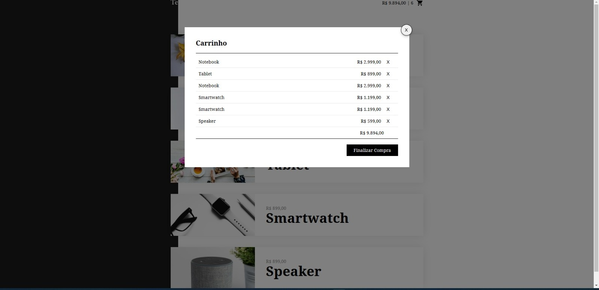

<div id="top">

# Projeto de Ecommerce em Vue com API em JSON

Este é um projeto simples de e-commerce que utiliza o framework Vue.js para renderizar os componentes e interagir com os dados de produtos armazenados em um arquivo JSON. A funcionalidade principal é adicionar produtos ao carrinho e armazenar esses dados no `localStorage.`
<br>
<br>

<h1>

## Estrutura de pastas e arquivos

<br>

O projeto está estruturado da seguinte forma:

```
techno/
├── api/
│   └── produtos/
│       ├── notebook/
│       ├── smartphone/
│       ├── smartwatch/
│       ├── speaker/
│       └── tablet/
│
├── assets/
│
├── app.js
├── index.html
├── Readme.md
├── style.css
└── vue.min.js
```

- api: pasta que contém o arquivo JSON com os dados dos produtos.
- assets: pasta que contém as imagens dos produtos.
- app.js: arquivo principal da aplicação, que controla a lógica do carrinho de compras e o armazenamento de dados no Local Storage.
- index.html: arquivo HTML que contém a estrutura básica da página.
- Readme.md: arquivo de documentação do projeto.
- style.css: arquivo que contém os estilos CSS da página.
- vue.min.js: arquivo JavaScript com o framework Vue.
<br>
<br>
<h1>

## Funcionalidades

O projeto tem como objetivo apresentar a interação dos produtos no carrinho e o armazenamento dos dados no Local Storage. As imagens dos produtos são exibidas na página, junto com seus respectivos nomes e preços. O usuário pode adicionar os produtos ao carrinho, que é atualizado automaticamente. Os dados do carrinho são armazenados no Local Storage, para que sejam mantidos entre as sessões.
<br>
<br>

<h1>

## Tecnologias utilizadas

- HTML
- CSS
- JavaScript
- Vue
<br>
<br>
<h1>

## Imagens do projeto

<br>
<div>
    <p>Pagina principal</p>
    
    <br>
    <p>Modal</p>
    
    <br>
    <p>Adicionando produto</p>
    
    <br>
    <p>Carrinho com pedidos</p>
    
    <br>
    <p>Carrinho vázio</p>
    
</div>
<br>

<div align="center"> 
  
</div>

<h1></h1>

## Conclusão

<br>

Este projeto demonstra como é possível criar uma aplicação de ecommerce em Vue.js que permite ao usuário adicionar produtos a um carrinho de compras e armazenar essas informações no Local Storage do navegador. O Vue.js oferece uma estrutura flexível e modular que permite criar aplicativos escaláveis e de fácil manutenção, e o armazenamento no Local Storage permite que os dados sejam mantidos mesmo após o fechamento da página. Embora este projeto seja simples, ele pode ser facilmente expandido para incluir mais recursos e funcionalidades, como um sistema de autenticação e pagamento.
<br>

<h1>

## Links

<h3>
<a href="https://technoapp.netlify.app/" target="_blank">Veja o Deploy</a>

<h1>

## Autor Leandro Pereira

Me siga nas Redes:

<br>
<a href="https://linkedin.com/in/leandropereira-dev/" target="_blank">
    
</a>
<a href="https://www.instagram.com/le_codigo/" target="_blank">
    
</a> 
<br>
<br>
<h1>

<h3></h3>

Feito com muito estudo e dedicação por <a href="https://github.com/OLeandroPereira" target="_blank">Leandro Pereira.</a>

<h3>
<br>
<br>

<a href="#top">Voltar ao topo</a>
